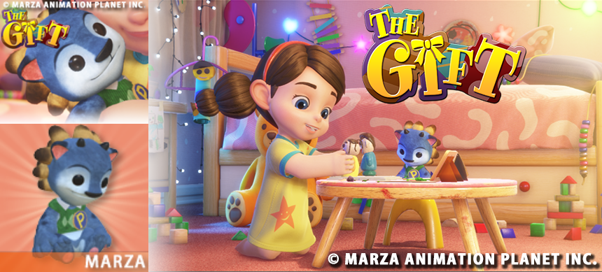
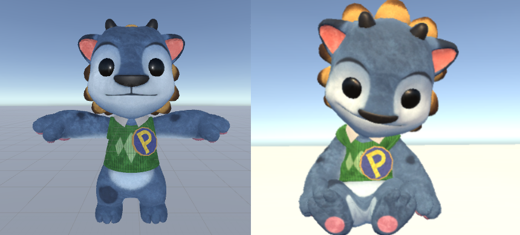

# GIFT_PorterDoll
PorterDoll Asset wtih "THE GIFT"

# About THE GIFT
"THE GIFT" is  Short Film by Tokyo based MARZA ANIMATION PLANET INC. 

This short film was created using “MARZA Movie Pipeline for Unity” co-developed with Unity Technologies. 

MARZA ANIMATION PLANET INC http://www.marza.com/

http://marza-realtime.com/

"THE GIFT"
https://www.youtube.com/watch?v=FQhlnsbgrL0

# Images

  

  

## Unity Setting and Load

copy PoterDoll-Folder and the following files from the PoterDoll-Folder to Assets with Unity.

set Color Space with Linear, Unity - Project Settings - Player - Other Settings - Color Spalce .

Load porterDoll.unity included Scenes folder.

PoterDollフォッルダー以下のファイルをUnityのAssets以下にコピーしてください

本サンプルデータはプロジェクトセッティングのカラースペースをリニアに設定する必要があります。
（Unity - Project Settings - Player - Other Settings - Color Spalce）

シーンフォルダー以下にあるporterDoll.unityを読み込んでください。

## License

### Data License
These data are licensed under Creative Commons.

THE GIFT by MARZA ANIMATION PLANET is licensed under a Creative Commons Attribution-NonCommercial 4.0 International License.
Based on a work at http://marza-realtime.com/.

### Code License
The MIT License (MIT)

Copyright (c) 2015-2016 marza animation planet 

Permission is hereby granted, free of charge, to any person obtaining a copy
of this software and associated documentation files (the "Software"), to deal
in the Software without restriction, including without limitation the rights
to use, copy, modify, merge, publish, distribute, sublicense, and/or sell
copies of the Software, and to permit persons to whom the Software is
furnished to do so, subject to the following conditions:

The above copyright notice and this permission notice shall be included in all
copies or substantial portions of the Software.

THE SOFTWARE IS PROVIDED "AS IS", WITHOUT WARRANTY OF ANY KIND, EXPRESS OR
IMPLIED, INCLUDING BUT NOT LIMITED TO THE WARRANTIES OF MERCHANTABILITY,
FITNESS FOR A PARTICULAR PURPOSE AND NONINFRINGEMENT. IN NO EVENT SHALL THE
AUTHORS OR COPYRIGHT HOLDERS BE LIABLE FOR ANY CLAIM, DAMAGES OR OTHER
LIABILITY, WHETHER IN AN ACTION OF CONTRACT, TORT OR OTHERWISE, ARISING FROM,
OUT OF OR IN CONNECTION WITH THE SOFTWARE OR THE USE OR OTHER DEALINGS IN THE
SOFTWARE.

